# Sofle Choc Wireless Keyboard - build guide


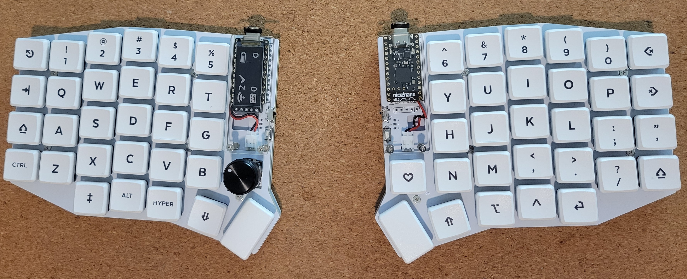
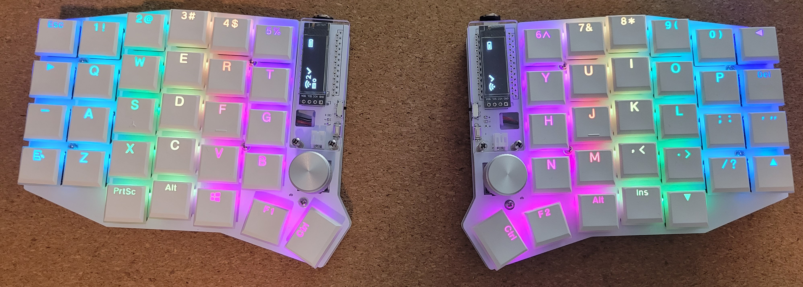
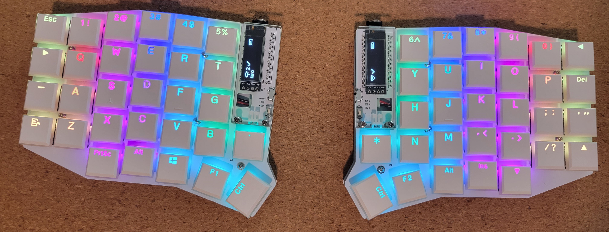

The Sofle Choc Wireless is a variation of the Sofle Choc with:

   - on/off switch for battery power
   - battery terminals / JST connector
   - support for 5-pin display such as the [nice!view](https://nicekeyboards.com/docs/nice-view/)

This version supports [Kailh Choc v1 switches](https://deskthority.net/wiki/Kailh_PG1350_series). Kailh hotswap sockets are required. Per-key RGB is optional and uses the relatively easy to solder SK6812 MINI-E LEDs.

The top plates are not compatible with any other Sofle version. The bottom plate is optional to allow for minimal thickness. It should work with the Sofle Choc (wired) as well.

The Sofle Choc Wireless was designed by db, and is closely based on the Sofle Choc (wired) by [Brian Low](https://github.com/brianlow), which was based on the excellent Sofle RGB by [Dane Evans](https://github.com/DaneEvans), which was based on the original Sofle v2 by [Josef Adamčík](https://github.com/josefadamcik).

## Ways to build this keyboard

This keyboard can be built differently, depending on your preferences. The following is a simplified version of the two styles that I have built this board and the major components that differ between them:

|*Component*|Low-power consumption/Lowest profile|High battery capacity|
|---------------|---------------|---------------|
|*Battery*|301230 LiPo|306080 LiPo|
|*Bottom plate*|Optional|Required|
|*Display*|nice!view (or none)|OLED or nice!view (still optional)|
|*RGB LEDs*|Not recommended|Go for it :)|
|*Bottom plate spacers/standoffs*|5mm (or none, if no bottom plate)|9mm|

*Note: it is possible to use an OLED display with the Low-power consumption options instead of the nice!view, but this will drain the battery significantly quicker*

These are just a couple of the options you can choose from, but these are certainly not the only ways to build this keyboard. Others may choose to combine elements of both, for example, building without a bottom plate, but keeping the RGB LEDs. This option also means that you must consider your firmware settings carefully, such as enabling the ZMK config option that shuts off the LEDs when the keyboard is not plugged into USB: `CONFIG_ZMK_RGB_UNDERGLOW_AUTO_OFF_USB = y`. Otherwise, the battery life will be so short that the keyboard is not usable.

### Battery life considerations

- Battery life for the Low-power consumption style build will be significantly longer than the other style, assuming your battery has around 100mAh capacity, which is common for the 301230 size of LiPo battery pack. Getting around 7 days of battery life on the central half is realistic with this style of build, with the peripheral side likely to get more than that by a significant amount.

- With the High battery capacity build option, RGB LEDs installed, and a 306080 LiPo battery, the most you can get is about a couple of days worth of actual usage with a pretty conservative brightness level (<50%), and using a configuration that shuts off the LEDs after a reasonably short timeout period (5 min or so). That is assuming the 306080 LiPo has around 2500mAh capacity, which is the type that I've used for this style of build.
  - Larger batteries also take longer to charge, so using the higher charging current jumper on the nice!nano v2 is recommended for this style of build as well. Without the higher charging current, the charge current is 100mA, so a 2500mAh battery could take up to 25 hours to charge :(   With the higher charging current (500mA), a 2500mAh battery would charge in closer to 5 hours from completely empty. If used for a full day, then plugged in to charge for a couple hours at the end of the day, your charge should always be at a pretty comfortable level.

  - This has been my experience, but as always, yours may differ, and this style of build certainly has its compromises -- mostly for the sake of RGB, as the LEDs are by far the biggest power consumer.

See the ZMK power profiler for more details: https://zmk.dev/power-profiler

## Bill of materials

The following are needed to build the keyboard:

- **2 PCBs** - Send the zip from `Gerbers\SofleChocWireless\SofleChocWireless.zip` to a PCB fabrication service. The PCB should be 1.6mm thick. Otherwise I used JLCPCB's default settings only customizing the PCB color.

- **2 top plates** - Send the zip `Gerbers\SofleChocWirelessTopPlate\SofleChocWirelessTopPlate.zip` to a PCB fabrication service. The top plate holds the switches in place. The top plate should be 1.2mm thick. Otherwise I used JLCPCB's default settings, only customizing the PCB color.

- **2 bottom plate PCBs (optional)** - `Gerbers\SofleChocWirelessBottomPlate\SofleChocWirelessBottomPlate.zip`. The bottom plates can be 1.6mm or 1.2mm thick PCBs, either will work.
- **10 M2 spacers/standoffs (female/female threaded: 5 per half)** - If you plan to fit your battery under the microcontroller and also use a bottom plate, 5mm spacers will be long enough so that the bottom plate doesn't touch the switch sockets. (Don't forget 4 additional spacers for the display covers if that's part of your build -- these will need to be 10 to 12mm to accommodate the height of the microcontroller and potentially the display, if included)
- **20 M2 Screws** - These are used to attach the bottom plates to the top plates (don't forget you'll need 8 more screws to use for attaching the display cover (4 for each side) if your build includes this). If using 5mm spacers or shorter to attach the bottom plate, you will want screws with a 3mm or 4mm shaft so that they don't collide with each other inside the spacer.

- **2 Wireless Pro Micro-compatible microcontroller boards** such as the [nice!nano](https://nicekeyboards.com/nice-nano#find-a-store), [nrfMicro](https://github.com/joric/nrfmicro/wiki), or [BlueMicro840](http://store.jpconstantineau.com/#/item/BMicro840). I have only used the nice!nano v2 for this board, so that's the only one I know will support all the features described here.

- **4x 12 pin headers (and optional sockets)** - for the microcontrollers. There are several ways to mount microcontrollers to the board. The male pin headers you most likely got with the board can be used to solder it directly to the board. This makes it hard to replace the board if it fails, it's not recommended. One option is to socket the Pro Micro using the diode legs approach [described at splitkb.com][promicrosocketing] with two 12-pin female headers. [Spring pin headers][springpinheader] are used on similar keyboards and should give a compact, non-permanent connection but are not always available. In order to fit a 301230 LiPo battery under the microcontroller, you'll need to find the 4mm tall spring pin headers, and the microcontroller will need to be mounted with the components facing up.

- **58 to 60 Kailh Choc keyboard switches** - Must be [Kailh Choc v1 switches (PG1350)](https://deskthority.net/wiki/Kailh_PG1350_series) of any color. The `PG` prefix is often omitted. **Don't** buy [Kailh Choc v2](https://deskthority.net/wiki/Kailh_PG1353_series), [Kailh Mini Choc](https://deskthority.net/wiki/Kailh_PG1232_series) or [Cherry MX](https://deskthority.net/wiki/Cherry_MX). 58 switches will be enough if you use both encoders, 60 will be enough if you use choc switches instead of encoders.

- **58 Kailh Choc keyboard switch sockets** - Sockets are specific to the PG1350 switch. The PCB requires sockets. Switches cannot be soldered directly to the board, with the only exception being if you choose to put a switch in place of the encoder, that switch can be soldered, but Mill-Max sockets are recommended instead.

- **58 to 60 keycaps**. You can use all `1u` size keycaps, but the two thumb keys will fit a `1.25u` or `1.5u` keycap.

- **60 diodes 1N4148W**. Surface mount diodes in SOD123 package. Pick any common variation.

- **2 buttons** For the reset switch. Momentary, tactile, through-hole, 2 pins: 3x6x4.3mm. Technically optional: you can use metal tweezers whenever you need to reset the microcontroller, but a button is more convenient. Through-hole tactile buttons [similar to these](https://www.amazon.com/gp/product/B07H9ZSZD4/) are what the board is technically designed for, but SMT buttons work as well. For SMT, you can just bend the tabs down at about a 45 degree angle so that the tab is sitting down below the surface in each through-hole. [This type](https://www.digikey.com/en/products/detail/c-k/PTS636-SM25F-SMTR-LFS/10071742) works well if you choose a surface-mount option, which also has a lower profile.

- **2 SPDT SMT slide switches** for battery power on/off switches. This is a common style, similar to the ones found [here](https://www.digikey.com/en/products/detail/nidec-copal-electronics/CUS-12TB/1124222), [here](https://mkultra.click/alps-ssss811101/), or [here](https://www.amazon.com/gp/product/B00E6QJ6YK).

- **8 - 10 adhesive bumpers**. Used as feet to keep the keyboard from moving. If you build with a bottom plate, get the smallest, thinnest option (~2mm or less), and I also recommend getting flat top screws with the thinnest head possible, to reduce the chance of the screws bottoming out past the thickness of the rubber feet.
This could cause the screws to scratch up the surface that the keyboard is on. Otherwise, if you don't use a bottom plate, your bumpers can be installed to the bottom of the PCB and should stick out slightly past the thickness of the hotswap sockets, which are generally the thickest component on that side of the board. If not using a bottom plate, 2mm should be close to the minimum thickness you want for the bumpers. 3mm is a bit safer. 

- **2x LiPo Batteries** 
  - *The most compact option*, and one that will fit under most socketed microcontroller installations, is the 301230 LiPo battery pack, which is 3mm thick, and just shorter than the length of the microcontroller board, so these are the most suitable for low-power consumption builds. If installing the optional JST battery connector, [these batteries](https://mkultra.click/301230-lipo-battery-with-jst-connector/) work perfectly, as they already have the JST plug attached. Other options are to solder the battery wires directly to the +/- terminals on the PCB, splice wires with a JST plug attached to them, or crimp a JST connector onto the end of the battery wires yourself. 
  - *If you choose to build for maximum battery capacity* (to support the high power consumption of RGB LEDs, for example), you can do this by installing longer standoffs (9mm work for this scenario) between the top and bottom plate and sandwich a larger battery between the PCB and bottom plate. This works with a 306080 LiPo battery pack, which also happens to fit between the two columns of mounting screws that attach the top plate to the bottom plate. To keep it from moving around, I first put a layer of masking tape with the sticky side towards the back of the PCB, sized just a little larger than the dimensions of the battery pack. Then, I created a loop of masking tape, sticky-side out, to stick the battery to the non-sticky side of the masking tape on the back of the PCB. This is just a cheap hack that seems to work fine. The bottom plate keeps the battery pretty close to the PCB in this configuration, so the tape can't really peel off and allow the battery to slide around. Keep in mind, you never want to apply pressure to LiPo battery packs, so make sure you don't get too short of standoffs that cause the bottom plate to clamp down on the battery pack against the components on the back of the main PCB. This could easily cause bad things to happen with your battery pack.

*See the following for an example of how the 306080 LiPo fits into the Sofle Choc Wireless*
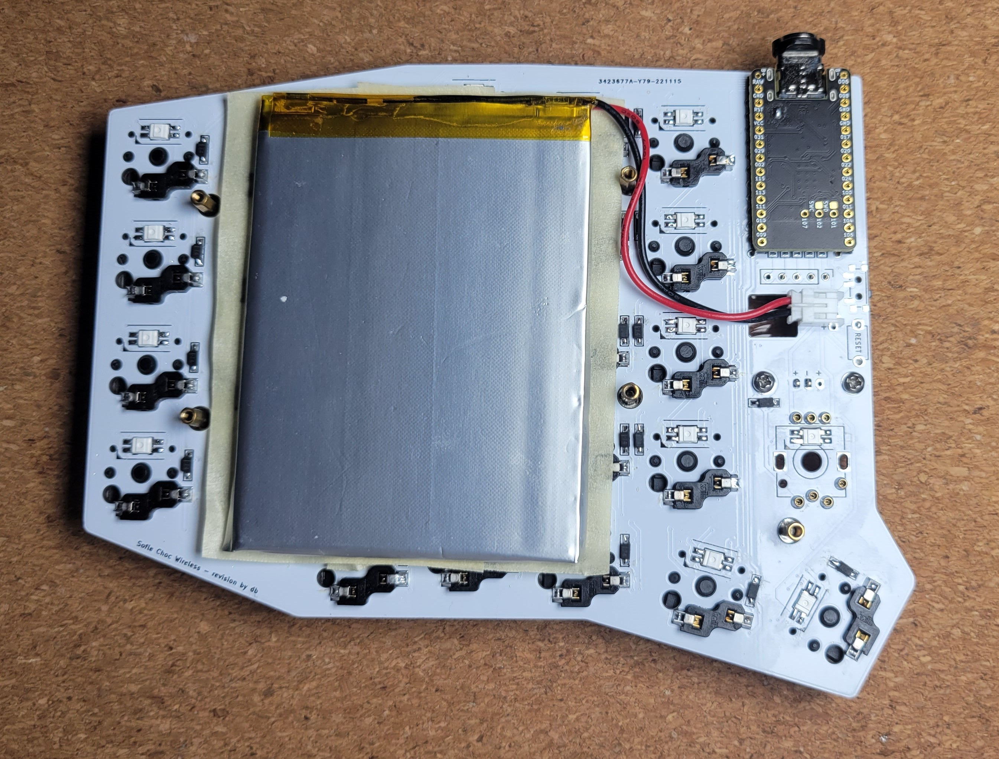

Optional components:

- **Up to 14 Mill-Max sockets** 14 Mill-Max sockets will cover all possible positions they can be installed on this keyboard, including 5 for each encoder, plus 2 for each Choc Switch (x2 to cover both halves). These are completely optional, but installing all of them will allow for swapping out an encoder for a Choc switch on either or both sides. Mill-Max part number [3305-1-15-80-47-27-10-0](https://www.mill-max.com/products/receptacle/3305/3305-1-15-80-47-27-10-0) are tested and good for this application. They have an outer shell that looks silver as the outer coating material is tin over nickel.  This version is also an option: [3305-1-15-15-47-27-10-0](https://www.mill-max.com/products/receptacle/3305/3305-1-15-15-47-27-10-0). The size and shape are the same, the only difference seems to be the outer plating material on these is gold. The points where the switch comes in contact with the socket is gold for both of these options. The important characteristic for these to work well in this board is that they should sit as low as possible above the surface of the PCB so that when using a Choc switch, it sits as flat as possible on the PCB.

- **JST socket** For connecting a battery. This is optional, as you can hard-solder the battery +/- wires to the +/- terminals on the keyboard PCB, but using the JST connector will allow for changing the battery without soldering or desoldering it. 
This option will work with most LiPo batteries that have a JST connector (JST PH 2.0mm): [S2B-PH-K-S(LF)(SN)](https://www.digikey.com/en/products/detail/jst-sales-america-inc/S2B-PH-K-S-LF-SN/926626).

**Choose either 4-pin OLED displays (1 or 2), nice!view displays (1 or 2) or no display at all**

- **For displays**
  
  - **OLED option - 1 or 2x SSD1306 128x32 OLED display module** - 4-pin, I2C, 0.91". Very common.
      - **1 or 2x 4 pin header (and optionally socket)** - for OLEDs. These sometimes come included with the OLED unit, and may be pre-soldered. You can solder the OLED directly to the board. Ideally use a socket so you can replace and/or get to the microcontroller underneath. 4 pin female headers with half height (~4-5mm) insulation work well.
  
  - **nice!view option - 1 or 2x nice!view displays** - these come with a set of 5-pin male pin headers and a half-height 5-pin female socket

  - **OLED Covers**

    - **2 OLED covers cut from acrylic** - Technically optional, but displays seem pretty fragile to me without them. The files for these are in the `SofleChocWireless/Case/OledCover` folder. The same OLED cover from the Sofle RGB also works: this is the file called `oled-cover-option1` in either svg or dxf format. `oled-cover-option2` is modified to give more space for a slightly larger encoder knob, but otherwise is functionally identical. These are typically laser-cut from 3mm thick acrylic.
    - **4 M2 spacers/standoffs (female/female threaded) to mount the OLED covers*** - (2 for each). The height of these depends on how high your microcontroller sits off the PCB, and ultimately the height of the display. 10mm spacers will work for most configurations, but 12mm may be required if using a socketed microcontroller with a display.
    - **8 M2 screws** - to attach the OLED covers and spacers to the PCB. 5mm to 6mm shaft M2 screws work well for this, as the acrylic used for the display covers is typically 3mm thick.


- **Rotary encoders**

    - **1 or 2 Rotary encoders EC11** - If you're not sure, take EC11E. Some other variants (EC11K) may have some additional plastic pins and require mounting holes for them which are not included on the PCB. Some encoders do not include a push-button switch, so look for encoders that include this feature when buying if you want that functionality.
      - A few encoder options:
          - [Bourns PEC11L-4115F-S0020](https://www.digikey.com/en/products/detail/bourns-inc/PEC11L-4115F-S0020/4699168) - a low-profile option that has a push-button switch, and fairly strong detents (detents are the "tactile bumps" when you twist the knob). Has a D-shaped shaft and the base is black plastic, which looks better than most other options, which are usually green. These may come with a mounting washer and nut, but they are not necessary.
          - Amazon option: https://www.amazon.com/gp/product/B0177VGSQY - low profile, even shorter shaft than the above Bourns option, but the height that the knob will sit on this one is about the same as the above Bourns low-profile encoder, so the overall height is almost identical. This one is significantly easier to turn because the detents are less forceful, but it gives less of a tactile feel during rotation. It has a D-shaped shaft and a green plastic base.
          - [TT Electronics EN11-HSB1AF15](https://www.digikey.com/en/products/detail/tt-electronics-bi/EN11-HSB1AF15/2408764) - Not quite as low-profile as either of the above options, but otherwise a good option. It has a smooth rotation feel, and is significantly easier to turn than the Bourns. The detents have more of a rounded bump to them. Has a D-shaped shaft and a green plastic base. Also of note is that this model is oriented in the opposite rotation direction as the other two options in terms of the electrical signals it produces, but this is not an issue, as your keymap can be configured to simply swap the left and right rotation key mappings as needed, in order to match the key mapping to the proper rotation direction.
    
    - **Matching knobs** - for each encoder. Make sure the knob matches the encoder's shaft diameter, depth and shape. All of the above encoder options will fit knobs with a 6mm shaft opening. Encoder shafts can be either D-shaped or knurled, which require the corresponding type of knobs to fit them. Knobs up to 20mm in diamater will fit without bumping into any of the keys or the (optional) OLED cover. A larger knob may even be possible to install, but I have not tried one larger than 20mm, since it comes within 1 or 2mm of the the OLED cover. A larger knob will result in the encoder feeling easier to turn, which I find preferable over a smaller diameter. 
    
      Commonly available knobs made for D-shaft encoders come with a set screw that holds them in place against the flatted end of the encoder shaft. The set screw typically has a hex head, and sometimes the knobs will come with a hex key, but unless specifically mentioned, they do not. Typically, they require either a 1.5mm or 2mm hex key or hex driver. 
    
      These considerations all apply to D-shaft knobs, however there are knurled shaft encoder and knob options, I'm just not very familiar with those and their various options.

- **LEDs**
  - **60 SK6812 MINI-E RGB LEDs** - The LED body 3.2x2.8x1.7mm and with legs is 5.8x2.8. Avoid the non-MINI-E version without the legs. Purchase a few extra as they are somewhat delicate.

## Tools and materials

- soldering iron and solder
- no-clean flux makes soldering easier
- solder wick or desoldering pump to correct mistakes
- good tweezers
- flush cutters to trim diode legs when socketing the microcontroller
- masking, kapton or electrical tape
- isopropyl-alcohol for cleaning
- small screwdriver
- mulitmeter for troubleshooting


## Build steps

### Prepare

Make sure you know which side you are working on, and don't make two left hand sides by mistake. Stick a piece of tape on the front side of both PCBs to help remember.

This guide is written in the order to install the components.

We will start with the components on the back, shortest to tallest:
  - diodes
  - LEDs (optional)
  - switch sockets

Then install the components on the front:
  - Display jumpers (if installing a display)
  - Microcontroller & socket
  - Display & socket
  - Reset switch
  - Encoder

The order of assemby does not matter **except** for these 3 components because they stack on top of one another:
  1. the display jumpers
  2. the microcontroller
  3. the display

### Switch Sockets and Diodes


These components are placed on the back of the PCB.

Diodes must be oriented with the white band in the direction of the "arrow" symbol on the PCB. I typically tin one pad first, then pick up the diode with tweezers and move it into the melted solder and remove the soldering iron until the solder cools, keeping some downward pressure on the diode so that it stays flat against the PCB. After one pad is soldered, come back and solder the other pad. 

Considering that you will be doing the same thing 30 times on each half of the board, the most efficient way I've found to do this for the entire board is to:
1. Tin 1 pad of every diode location on the PCB with solder
2. Place all the diodes down on the PCB next to the location they will be soldered, pointing in the correct direction
3. Go to each diode and solder the first pad according to the process mentioned above
4. Come back to each of the diodes and solder the 2nd pad until they're all soldered on both pads
5. Take a careful look at each of the diodes to make sure you didn't miss any

The hotswap switch sockets are the largest and easiest component to solder on the back of the PCB. They are installed on the back of the PCB facing up towards the front of the PCB, and when placed into the holes in the PCB, they will match the outline on the PCB silkscreen. Make sure they're completely flat on the PCB when soldering. To solder them on, heat the metal connector at the edge of the socket where it sits on top of the PCB pad, apply solder, and look for the solder to wick down to the PCB. You want a solid joint, since this may take some mechanical strain from switch installation and removal, so there's no need to be stingy with the solder on these joints. It helps to hold down the socket with some pressure from your tweezers while soldering the joints.

### Mill-Max sockets (optional)

7 Mill-Max sockets can be installed on each half, for a total of 14 for both halves. They can be installed on the 5 small circular pins used for the encoder (not used for the larger oval shaped mounting point holes), and for the 2 pins used for the Choc switch that can be installed in the same position. (See photo below)

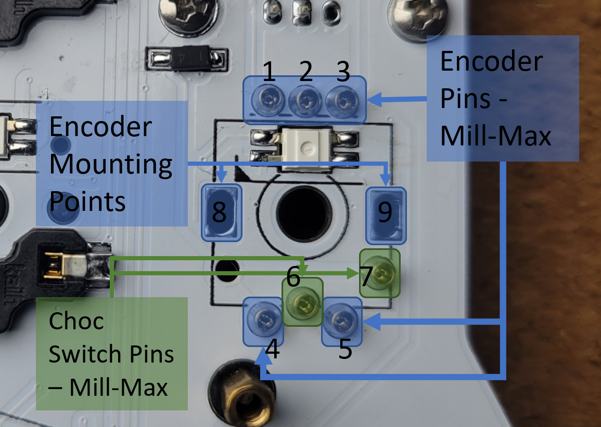
(*Above: view of the Mill-Max locations from the bottom of the PCB*)

See above for locations where Mill-Max sockets can be installed: 
- Pins 1 through 5 are used by the encoder. Mill-Max sockets can be installed here if desired.
- Pins 6 and 7 are use by the choc switch (these are reversed on the opposite half). These can also use Mill-Max sockets.

Pins 8 and 9 are mounting point attachments for the encoder. These 2 pins can be soldered to the mounting legs of the encoder to provide more stability.

If not using Mill-Max sockets, the encoder or Choc switch can be soldered in at a later step. If installing a Choc switch without Mill-Max sockets, do this after all other components have been installed and the top plate is put in place. Probably best to leave the switch until the very last step to install if you choose this option.

To make it easier to install these, it's best to do it before anything has been soldered to the top side of the PCB, so that you can lay the board flat with the Mill-Max sockets in place, and they'll be pressed firmly into the PCB. 

**To install the Mill-Max sockets:**

1. With the PCB face up, place them into the holes
2. Then, tape over them on the front side of the board to keep them in place. Masking tape works well for this.

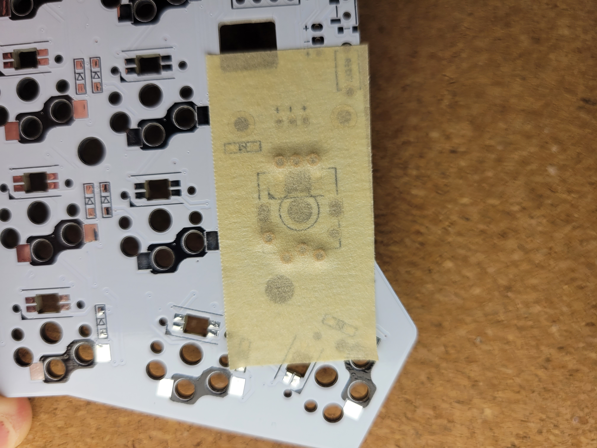
(*Above: view of the top of the PCB with tape over the Mill-Max sockets before soldering*)

3. Then, flip the board over, making sure they're pressed into place firmly before and during soldering, and solder them from the back side of the PCB, where the diodes and sockets are soldered. It helps to have a very small diameter solder wire (I prefer 0.5mm) to solder the sockets. Heat up the side of the socket and the through hole pad together, then feed a small amount of solder into the joint until the solder wicks around the edge of the socket. Be careful to avoid getting any solder into the center of the socket.


### The LEDs (optional)


LEDs are placed on the back of the PCB. The lens should point up through the PCB so they shine into the bottom of the switch. One leg will have a diagonal cut. This cut leg should be aligned with the triangular marking on the PCB.

To solder: First, use a lower temperature setting to solder the RGB LEDs. I use 270C, but some use lower, some use higher. Tin one pad, place the LED and hold using tweezers, apply heat to the leg until the solder melts and the LED is flush with the board. Now the remaining legs can be soldered without the component moving. The LEDs are sensitive to heat. Let the LED cool between soldering each leg. Use the lowest heat needed for your solder.

The LED control circuit is in one long chain. If one LED is not working, inspect the connections for that LED and the LED preceeding it. Sometimes just the output of a LED is damaged. The full chain does not need to be installed if you want to test a partially built board. The top inner-most LED closest to the top of the microcontroller is the first one in the chain, and they snake around the board, going down first, then back up on the next column, etc.

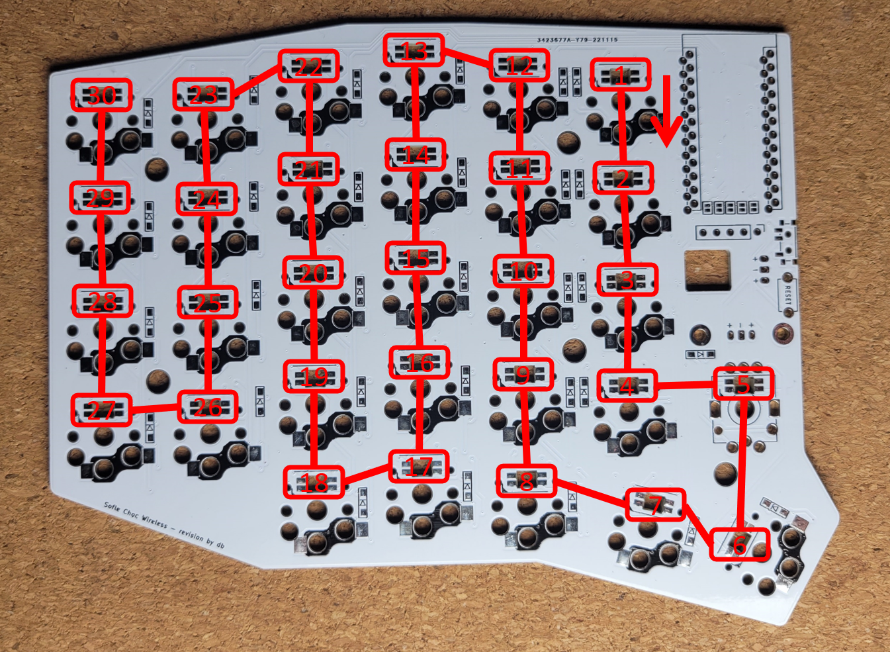

### Display Jumpers

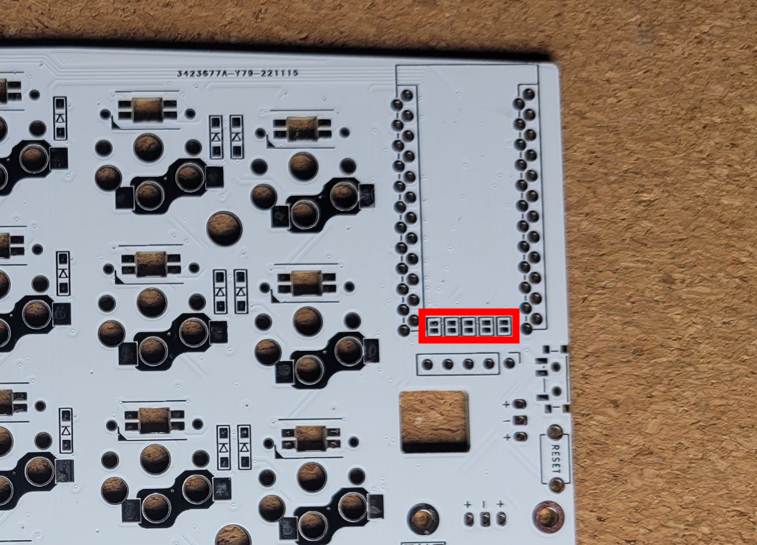

The jumpers in the above photo should be bridged if using a display. The jumpers may not be accessible later in the build depending on how the microcontroller is attached. Bridge the jumpers on the *top* side of the board, the opposite side from where the sockets and diodes are soldered. It's fine to bridge all 5 jumpers, even if using a 4-pin OLED -- this will not cause issues.

This is how the jumpers should look after bridging them:

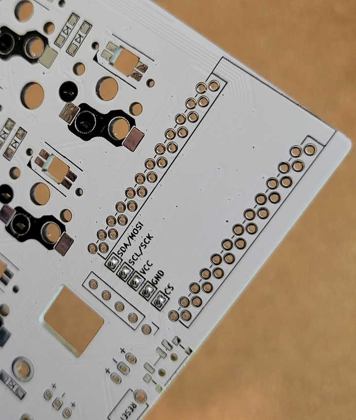

### Power switch and reset button

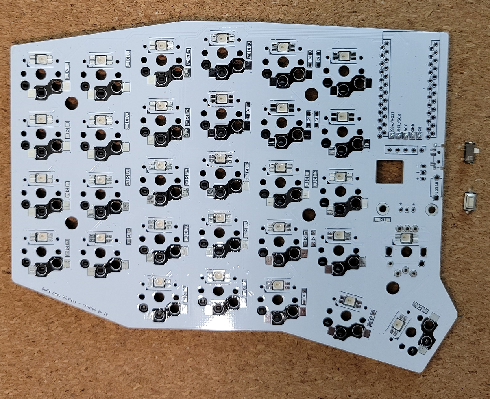

#### Power Switch

The power switch has 2 small bumps that fit into locating holes in the PCB, which help keep it in place while soldering. Tin one pad on the PCB, then put the switch in place over it. Put some downward pressure on the switch with tweezers, then press down on the switch leg that's sitting on the tinned pad with the iron until the switch leg sinks down fully into the solder, then remove the iron.

After this pin is soldered, solder the other pads by heating each leg and pad, then feeding solder into the joint until the joint fills with solder, then remove the iron.

Flux can be helpful for this step, as these are small surface-mount joints, but be careful not to use too much flux, as it can get into the mechanical part of the switch and potentially cause problems for the switch contact points. If possible, use a flux pen rather than flux paste, and in small amounts.

#### Reset button

Solder the reset button (aka tact switch). 

If using a through-hole type, insert the legs of the button into the holes and use masking tape to hold it in place if needed before soldering the legs in place from the back of the PCB. (This option is not pictured in this guide.)

If using a surface mount type, bend back the legs of the button to around 45 degrees before placing it onto the PCB.

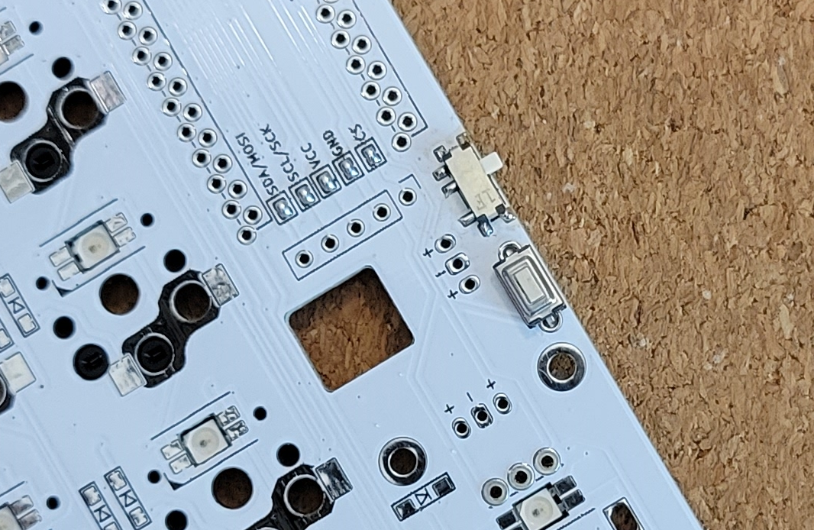

*The above shows the reset button in place before soldering. The power switch has already been soldered.*

With the button placed onto the PCB, heat up one of the pads and feed solder into the joint until solder fills the hole and covers the leg of the button. Once one side is soldered into place, heat up the remaining pad and fill the joint with solder, covering the leg of the button.


### Microcontroller

There are various options for how the microcontroller can be installed. Here, we'll describe just a couple of those options:
1. The Sprint Pin Header option
2. The Socket option

#### Spring Pin Header option
One option is to use spring pin headers. Using the 4mm variety will allow you to place a 301230 LiPo battery between the microcontroller and the PCB, which is the ideal place for it to keep the build as low-profile as possible. With the other socket options, the same type of battery will fit, as long as the sockets are tall enough.

If you use a 4mm spring pin header, installing the microcontroller with the components facing up will give the battery enough room to fit. However, this requires you to use the unmarked set of holes on the PCB. On the top of the PCB, the usual set of holes are marked with a black rectangle around them, which is intended for use with the microcontroller installed with components facing down, but if you install it with the components facing up, you must use the set of holes *without* with black rectangle around them, or the board will not function. For the components facing up configuration, the unmarked set of holes is the set of holes on the *left*, regardless of whether you're working on the left half or right half.

With the nice!nano, the spring pin headers will stay attached to the microcontroller without soldering it. This is not the case with all microcontrollers, as it is dependent on the size of the through-holes on the microcontroller's PCB. It just so happens that the nice!nano has the right sized holes for the spring pin headers to stay attached without soldering. Soldering the spring pin headers to the microcontroller board is an option suggested in some guides that mention this type of header, because many pro-micro compatible boards have larger through-holes, so the spring pin headers don't engage into the holes otherwise. If you choose to use a nice!nano and spring pin headers, soldering is not necessary to attach them to the controller or to the keyboard PCB. Keep in mind with this option, though, it's possible to dislodge the microcontroller with an accidental bump or with the force of inserting / removing the USB cable if it's not carefully pushed straight into the connector.

To attach the spring pin headers to the nice!nano:
 1. You can do all of this at the very end of the build, if, for example, you want to put your 301230 LiPo battery underneath the nice!nano. If you mount the nice!nano first, you will just end up taking the nice!nano back off later to put the battery in, then putting the nice!nano back into place, which is doable, but extra work.
 1. Be very careful with the spring pin headers! The spring loaded pins are very small and fragile and can come out of place if you try to force them in the wrong way. And if you break them, you may not be able to fix them.
 1. Make sure you don't put them into the nice!nano pins for battery + and -, as these pins are too small and will damage the spring pins
 1. Orient the two header rows so that the small holes in the headers both face the same side before inserting them into the nice!nano
 1. Carefully line up the pins and insert the spring pin headers into the nice!nano
 1. To fully seat them, press the headers into the nice!nano. Don't press against the tiny metal pins themselves, only put pressure on the plastic part. It helps to use tweezers to very carefully squeeze the headers against the microcontroller, only putting pressure on the plastic header part. This can also be done without tweezers using your fingernails to press down on the edge of the nice!nano.
 1. Once the headers are firmly pressed into the nice!nano, carefully line the pins up to the holes on the keyboard PCB and place the nice!nano into position so that it's resting on the correct pins. (If your nice!nano components face up, use the non-marked sets of holes on the left. If not, use the other set. If you're trying to fit a 301230 battery under the microcontroller, face the components up and use the non-marked sets of holes. Friendly reminder that you'll need the 4mm spring pin headers to be able to fit a battery underneath the nice!nano. The 2mm or 2.5mm varieties don't give you enough room to fit one.)
 1. Once the pins are resting in the keyboard PCB holes, use your fingers to press down evenly on the four corners of the nice!nano until the plastic part of the header is flush with the keyboard PCB.
 1. If you got this far, your nice!nano is connected to your keyboard PCB with no solder ever touching the nice!nano. Rejoice!

Even though mounting the nice!nano with spring pin headers will keep the nice!nano attached, it is possible to loosen it when plugging in or removing the USB cable from the microcontroller. Because of this, it's not the most stable type of mounting solution, but I still prefer to use it whenever I can. If you choose this method, make sure to check periodically that the header is fully flush with the keyboard PCB and the nice!nano, especially if you have been plugging in and unplugging the USB cable often. This is another good reason to get magnetic USB cables for your keyboard microcontrollers, since there is much less force required to attach and detach the magnetic cable than plugging a cable into the nice!nano's USB port.

##### PCB design side note
As a side note, different keyboard PCBs have different sized microcontroller holes, which means that even if the nice!nano holds onto them snugly, the PCB might not. For the Sofle and its ancestors (Lily58, Helix, Corne, Ergo42), the microcontroller holes on the PCB mostly seem to be the same, and they seem to fit the spring pin headers well.

#### Socket option
For this option, the microcontroller is installed on the top of the board, upside down and in the marked holes.

* Top of the board: this is the side of the PCB opposite the diodes, LEDs and switch sockets
* Upside down: both Pro Micro components should face the PCB with the mostly plain back facing out
* Marked holes: there are two sets of holes in the PCB, use the holes with the rectangular outline on the top of the board

Double-check your work here. This step is hard to reverse if a mistake is made.

To install a socketed microcontroller using the diode leg approach [from splitkb.com][promicrosocketing]:

  1. To solder the headers to the PCB, first place the 12-pin female headers on the top of the board in the outlined through holes. Use some tape to temporarily tack them in place. Flip the board over onto a flat, hard surface. While soldering the first pins, push down on the PCB to ensure the headers are perpendicular and fully seated.

  2. To install the diode legs, first flip the board upright again. Place some tape over the sockets before inserting the diode legs to prevent solder from seeping down into the sockets in the next step. Masking tape works fine for this. Place the microcontroller upside down on top of the sockets. Push the diode legs though the microcontroller holes and through the tape so they're seated into the socket below. It helps to use pliers to press the diode legs in, so you reduce the chances of stabbing yourself with a sharp diode leg while doing this.

  3. Solder the legs to the microcontroller. Snip off the legs above the microcontroller.

If you ever need to remove the microcontroller: do it by gently prying the board up in small increments, working your way gradually around the board. Don't be surprised if removing it is not easy, though -- the sockets can have a surprisingly strong grip on the diode legs. However, the diode legs themselves are very flexible and will easily bend if you pull the microcontroller off by one side of the board, rather than loosening it evenly and gradually on both sides. Avoid pressure on the USB connector. 


### Display

When installed, the display will overhang the microcontroller. Since there are exposed components on the back of the display, adding some kapton tape or other insulating material to the bottom of the OLED module where it might contact the microcontroller is usually a good idea to prevent electrical shorting. Covering the exposed components on the back of the display is the main concern, as they have bare contact points that could short out against the microcontroller.

If you're using a 4-pin OLED display, use the 4 holes on the left which are outlined in a solid black outline on the PCB. If you're using a 5-pin display such as the nice!view, use a 5-pin female header, which is included with the display, and all 5 holes will be used.

If you're socketing the display (recommended), install the 4 or 5 pin female header on the top of the PCB and solder it into place. Then push the display pins into the socket. You may need to trim the male header pins so the insulation on the female and male headers mate and the display sits just above the microcontroller. The downside to socketing is that the display isn't as secure in the half height socket, and as a result, turning the keyboard upside down can cause the display to tilt away from the microcontroller somewhat. If you install a display cover, this is not as much of an issue, as the cover will keep the display from moving around too much.

### JST connector (optional)

There are 2 places on the PCB where the JST connector can be installed: a horizontal row and a vertical column of 3 pins each. These are functionally identical. Either will work, but *do not connect batteries to both at the same time*. The board does not support connecting 2 batteries, so choose one or the other, whichever is more suited to your build.

*Pay very careful attention that the correct pins go into the correct holes*, or you could cause battery issues by getting the positive and negative wires flipped the wrong way. The correct holes to use for your JST socket depend on the plug coming from your battery. I recommend plugging your battery into the JST connector before placing it into the PCB to match it to the correct holes first. Below are the ways that your battery JST connector might be configured. The red wire could be on either the right or the left:

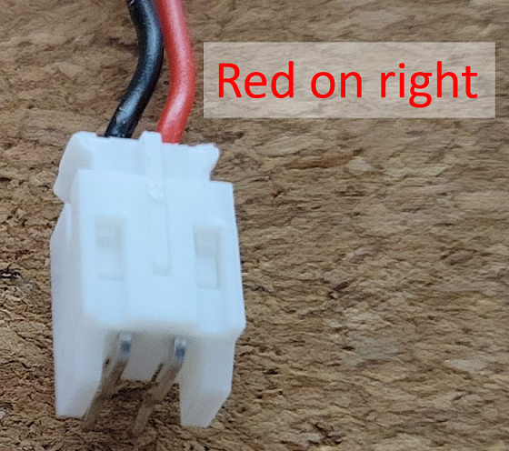

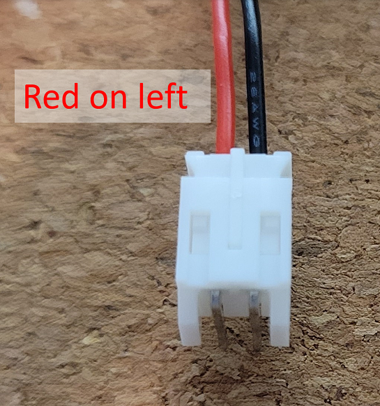

*The above 2 photos show the battery plugged into the JST connector before soldering, in order to tell which holes to use on the PCB*

Match RED to `+` and BLACK to `-`, which are labeled on the PCB. Since there are 3 holes in a row that are labeled `+`, `-`, `+`, the JST connector will fit into these in two positions, making it possible to get your connections flipped, causing potential battery issues, and also your board will not power on. 

With your battery plugged into the JST connector, match the pin connected to the RED wire to the `+` hole, and the BLACK wire to the `-` hole. 

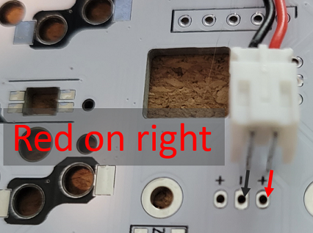

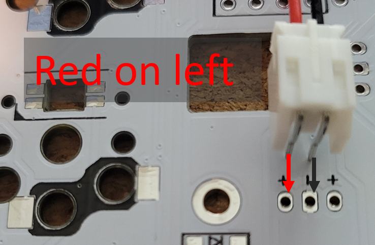

Once they're correctly matched, unplug the battery from the JST connector before soldering the JST connector to the PCB. Match the JST connector pins for both halves of the keyboard to ensure the proper connections are made on either side.


After determining the correct holes to solder your JST connector to, insert the JST connector into the holes. It helps to tape it into place, then flip the board over and solder the through-hole pins into place.

Alternatively, if your battery doesn't have a JST plug, you can solder your battery wires directly to the through holes on the board labeled `+` and `-`. RED goes to `+` and BLACK goes to `-`. This will allow the battery to be switched on and off by the switch.

## Install the encoder

If using the Mill-Max sockets for the encoder pin connections, make sure the pins on the encoder are all properly aligned before trying to insert into the sockets, then carefully insert the encoder into the sockets to avoid bending the pins if not properly aligned. Adjusting the larger "mounting point" pins can provide a little bit of mechanical stability, as they have a curve in them that can provide some additional pressure on the hole in the PCB to keep them in place. 

Keep in mind that the encoder will still be subject to a decent amount of movement if force is applied in a side-to-side direction. To address this, optionally, the two "mounting point" holes for the encoder (the larger oval-shaped holes with the rectangular solder pad) can be soldered in place to hold the encoder more securely. With these soldered, it is still much easier to desolder just these two mounting points to remove the encoder than if you solder all pins of the encoder to the PCB. 

It's also possible to solder all pins of the encoder and leave out the Mill-Max sockets entirely. If you choose to do this, insert the encoder into the PCB and solder all of the pins. It helps to provide some pressure on the encoder while soldering the first couple of pins, soldering 2 pins on opposite sides of the encoder will help hold it in place until the other pins are soldered. 


### Assemble

- Snap a few switches into the top plate, the corner switches work best

- Place the PCB on a flat surface. This will save some strain on the solder joints in the next step (though they should be able handle it).

- Carefully lower the top plate with switches on the main PCB and push into sockets. Ensure pins are aligned.

- Snap the remaining switches into the top plate pressing into the sockets.

- There are no standoffs between the PCB and top plate

- Place the encoder knob on the shaft. Tighten the set screw with a hex key. A small screwdriver for glasses may do in a pinch.

- Optionally add display covers (aka OLED covers)

- Put at least 4 adhesive rubber feet, aka bumpons, in the corners so the keyboard doesn't move when you type. I find that it helps to have 5 total: 1 in each of the far corners, then another one along the top edge where there's a gentle corner (close to where the 8 and 9 keys are). Also, on the inner side of the board, the side where the microcontroller is, it feels more stable if you line up the 2 bumpons with each other vertically, instead of putting them as close to the far corners of the PCB as possible.


## Warnings and disclaimers

- Be gentle with the USB ports on your microcontrollers. They are not easy to fix if damaged. A magnetic USB connector is commonly used with microcontrollers to reduce the strain on the microcontroller's USB port when connecting and disconnecting from a USB cable.
- Keep in mind that this is a prototype of a DIY keyboard. It's not a polished product.

## Firmware and programming

The Sofle Choc Wireless uses [ZMK Firmware][zmk_firmware].

The ZMK documentation has a guide for building and customizing your firmware, including customizing your keymap, setting your configuration options based on what devices and settings you use for your build, etc.: [ZMK Setup Guide][zmk_setup_guide]

This board uses the same layout as the Sofle keyboard that is already part of the ZMK repository, so your configurations can be done for the Sofle Choc Wireless keyboard as if it was the standard Sofle keyboard. The main differences for setting up your firmware build are whether you want to enable RGB LEDs and/or use the nice!view instead of the OLED display, which is the default supported display for the Sofle in ZMK. 

### nice!view setup ###
 To use the nice!view, you would need to add the nice_view_adapter and nice_view to your build config, so the build.yaml file would look something like this (*assuming you are building for the nice!nano v2 as your microcontroller board*): 

```
---
include:
  - board: nice_nano_v2
    shield: sofle_left nice_view_adapter nice_view
  - board: nice_nano_v2
    shield: sofle_right nice_view_adapter nice_view
```

Another config option that's necessary for the nice!view to work properly is the following line to be included in the `sofle.conf` file of your config repository:

```
CONFIG_ZMK_DISPLAY_WORK_QUEUE_DEDICATED=y
```
Without this config option, your keyboard may freeze, experience lag, or have connection issues. This option may be set as a default in the future, but at the time of writing this, it is not defaulted yet.

### RGB Config ###

For setting up RGB LEDs, the controller pin used for these corresponds to pin 8 of the nice!nano (Arduino Digital 0 / D0 Pro Micro pin), so if using a nice!nano, the LED config line you would need to use is `mosi-pin = <8>;` within your SPI configuration if building for the nice!nano. Also, note that since there are 30 LEDs on the Sofle Choc Wireless, you would use `chain-length = <30>;`. For more guidance on configuring LEDs, refer to the ZMK documentation for this topic: https://zmk.dev/docs/features/underglow.


## Troubleshooting

Refer to the build guide for hardware troubleshooting. The ZMK discord is also very helpful for firmware and keymap questions.


## Links

- [ZMK Firmware][zmk_firmware]
- [Original Sofle Choc Layout in KeyboardLayout editor][soflechoclayout] (for reference only, this may not match the default layout in ZMK)
- [Sourcing parts](https://github.com/josefadamcik/SofleKeyboard/blob/master/docs/sourcing_parts.md) - some of these may apply, but keep in mind many components are targeted at wired builds
- [NiceKeyboards](https://nicekeyboards.com/) - details about nice!nano and nice!view, and links to vendors where they're sold


[zmk_firmware]: <https://zmk.dev/> "ZMK Firmware"
[zmk_setup_guide]: <https://zmk.dev/docs/user-setup> "ZMK Setup Guide"
[layoutarticle]: <https://josef-adamcik.cz/electronics/in-search-of-the-best-custom-keyboard-layout.html> "In search of the best custom keyboard layout"
[introductionarticle]: <https://josef-adamcik.cz/electronics/let-me-introduce-you-sofle-keyboard-split-keyboard-based-on-lily58.html> "Let me introduce you SofleKeyboard - a split keyboard based on Lily58 and Crkbd"
[soflechoclayout]: http://www.keyboard-layout-editor.com/#/gists/5604075ad16c10a8c634828c5911d2b6 "Sofle Choc Keyboard layout at keyboard-layout-editor.com"
[qmk_firmware]: https://github.com/qmk/qmk_firmware/ "QMK firmware"


[qmk_configurator]: https://config.qmk.fm/#/sofle/rev1/LAYOUT "QMK configurator"
[springpinheader]: <https://yushakobo.jp/shop/a01mc-00/> "Spring pin headers - Japanese"
[qmkprotonc]: https://qmk.fm/proton-c/ "QMK Proton-C"
[promicrosocketing]: <https://docs.splitkb.com/hc/en-us/articles/360011263059> "How do I socket a microcontroller? by splitkb.com"
[qmkintro]: <https://beta.docs.qmk.fm/newbs/newbs_getting_started> "QMK getting started"
[qmkhandedness]: <https://docs.qmk.fm/#/feature_split_keyboard?id=setting-handedness> "QMK firmware - setting handedness"
[manufacturingproblems]: https://josef-adamcik.cz/electronics/corne-keyboard-build-log.html#manufacturing-at-jlcpcb---update-27112019 "Possible problems when manufacturing top plate for Corne"
[nooledlag]: https://github.com/qmk/qmk_firmware/issues/7522 "No OLED lag bug"
[soflegithub]: https://github.com/josefadamcik/SofleKeyboard "SofleKeyboard - KiCad project on Github.com"
[sourcing]: <{{ site.baseurl }}/sourcing_parts.html> "Sourcing parts"
